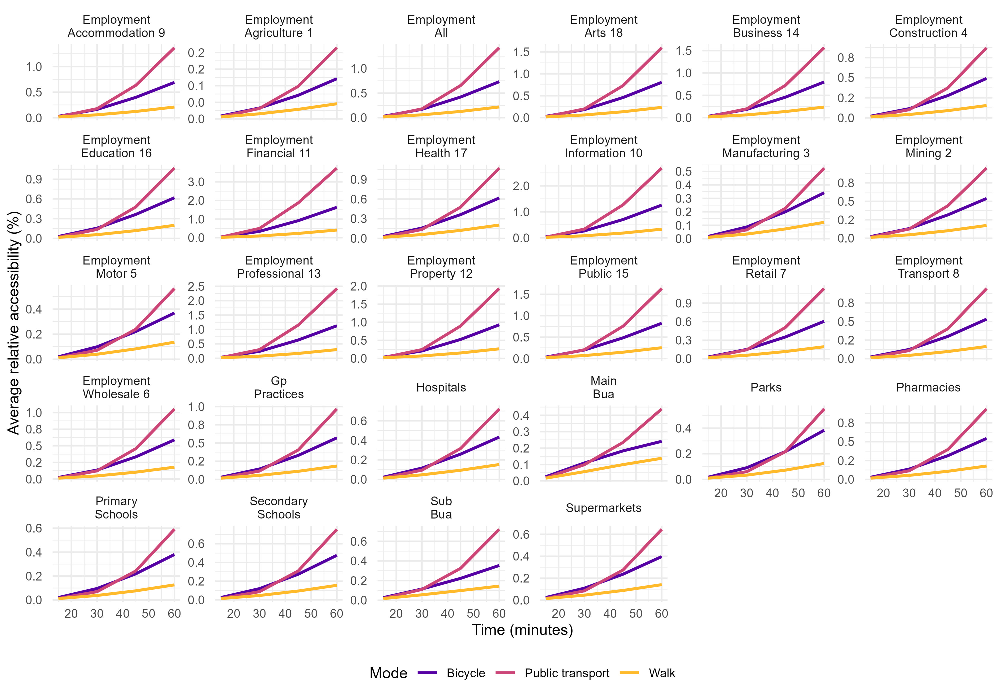

# Great Britain Accessibility Indicators 2023

This repository contains the code used to estimate the Great Britain Accessibility Indicators 2023 (AI23). 

The indicators correspond to the first quarter of 2023. The geographic coverage includes England, Scotland, and Wales. The geographic unit used is the 2011 LSOA/DZ version.

## Dataset

The dataset provides a suite of ready-to-use accessibility indicators to key services such as employment, general practices (GPs), hospitals, pharmacies, primary and secondary schools, supermarkets, main urban centres, and urban sub-centres. These indicators are available for 42,000 small area units across Great Britain, specifically at the Lower Super Output Area (LSOA) level in England and Wales, and the Data Zone (DZ) level in Scotland.

A full data descriptor is available at: <https://osf.io/preprints/socarxiv/qb9j4>.

Download dataset at: <https://data.ubdc.ac.uk/dataset/accessibility-indicators>



## Requirements

### Software Requirements
- R (version 4.0 or higher)
- RStudio (recommended)

### Required R Packages
The project requires the following R packages:

```r
# Data manipulation and visualization
install.packages("tidyverse")

# Spatial data handling
install.packages("sf")

# Interactive maps (for exploration)
install.packages("mapview")

# OpenStreetMap data access
install.packages("osmdata")

# Fast data manipulation
install.packages("data.table")

# File system operations
install.packages("fs")

# Table formatting for reports
install.packages("kableExtra")

# For PDF generation (descriptor document)
install.packages("rticles")

# Accessibility analysis (from GitHub)
install.packages("devtools")
devtools::install_github("urbanbigdatacentre/AccessUK")
```

### Data Requirements
The project requires several datasets that should be placed in the `data/` directory. Due to size constraints, the data folder is gitignored. You will need to obtain the following datasets:

1. **GP Practice Data**
   - Scotland: `data/gp_practice/isd_scotland/practice_contactdetails_jan2023-open-data.csv`
   - England/Wales: `data/gp_practice/nhs_england/epraccur/epraccur.csv`

2. **UK Postcodes**: `data/uk_postcodes/ONSPD_AUG_2022_UK/Data/ONSPD_AUG_2022_UK.csv`

3. **Schools Data**: `data/schools/england/extract/edubasealldata20230307.csv`

4. **Hospital Data**
   - England: `data/hospitals/england/Hospital_converted.csv`
   - Wales: `data/hospitals/wales/hospitals_wales.csv`

5. **Pharmacy Data**: `data/pharmacy/england/consol_pharmacy_list_202324q1.csv`

6. **Travel Time Matrices**: `data/ttm/` (public transport, walking, cycling)

7. **Geographic Lookup**: `data/uk_gov/Output_Area_Lookup_in_Great_Britain.csv`

8. **Previous Accessibility Data**: `data/pt_accessibility_22/destinations_summary.csv`

## How to Run the Project

### Option 1: Docker (Recommended for Reproducibility)

The easiest and most reliable way to run the analysis is using Docker, which provides a consistent environment:

#### Quick Docker Setup
```bash
# Build the Docker image
docker build -t ubdc/ptai-analysis .

# Run the complete analysis (mount your data directory)
docker run --rm \
  -v /path/to/your/data:/workspace/data:ro \
  -v $(pwd)/output:/workspace/output \
  -v $(pwd)/plots:/workspace/plots \
  ubdc/ptai-analysis
```

#### Using Docker Compose (Recommended)
```bash
# Copy and configure environment
cp .env.example .env
# Edit .env to set your data paths

# Run analysis
docker-compose up ptai-analysis

# For interactive development
docker-compose up -d ptai-interactive
docker-compose exec ptai-interactive bash
```

**Docker Benefits:**
- ✅ Consistent R environment across systems
- ✅ All dependencies pre-installed
- ✅ No local R setup required
- ✅ Isolated execution environment
- ✅ Resource management and monitoring

👉 **See [DOCKER.md](DOCKER.md) for detailed Docker instructions**

### Option 2: Automated Local Execution

For local R installations, use the provided automation scripts:

#### Using the Shell Script (macOS/Linux)
```bash
# Make sure you're in the project directory
cd /path/to/PTAI

# Run the complete pipeline
./run_pipeline.sh
```

#### Using the R Script
```r
# Open R or RStudio in the project directory
# Run the master script
source("run_analysis.R")
```

**Features of the automated pipeline:**
- ✅ Runs all 13 analysis steps in correct order
- ✅ Logs execution time for each step
- ✅ Handles errors gracefully and continues with remaining steps
- ✅ Creates detailed execution log with timestamps
- ✅ Provides comprehensive summary at completion
- ✅ Backs up existing outputs before running
- ✅ Checks for required files and directories

### Option 3: Manual Step-by-Step Execution

If you prefer to run steps individually or need to debug specific steps:

#### 1. Setup
1. Clone this repository
2. Open the R project file `accessibility_indices23.Rproj` in RStudio
3. Install all required packages (see Requirements section)
4. Obtain and place all required datasets in the `data/` directory

#### 2. Execution Order
The R scripts should be run in numerical order. Each script processes specific types of services and generates intermediate datasets:

```r
# 1. Process GP practices data
source("R/01_gp_practice.r")

# 2. Process supermarkets data (from OpenStreetMap)
source("R/02_supermarkets.r")

# 3. Process employment data
source("R/03_employment.R")

# 4. Process schools data
source("R/04_schools.r")

# 5. Process urban centres data
source("R/05_urban_centre.r")

# 6. Process hospitals data
source("R/06_hospitals.r")

# 7. Process pharmacies data
source("R/07_pharmacies.r")

# 8. Process parks and gardens data
source("R/08_parks_gardens.R")

# 9. Aggregate all services at LSOA/DZ level
source("R/09_aggregate_services.R")

# 10. Estimate accessibility indicators (main analysis)
source("R/10_estimate_accessibility.R")

# 11. Exploratory data analysis
source("R/11_exploratory.R")

# 12. Create destination summary
source("R/12_destination_summary.R")

# 13. Generate file inventory
source("R/13_file_inventory.R")
```

### 3. Key Outputs
- **Accessibility indicators**: Stored in `output/` directory
- **Plots**: Generated in `plots/` directory
- **Summary statistics**: Various CSV files with destination counts and summaries
- **File inventory**: `output/inventory.csv` lists all generated files
- **Execution log**: `output/execution_log_YYYYMMDD_HHMMSS.csv` contains timing and status information

### 4. Main Analysis Script
The core accessibility analysis is performed in `R/10_estimate_accessibility.R`, which:
- Uses the `AccessUK` package to compute accessibility indicators
- Processes multiple transport modes (public transport, walking, cycling)
- Calculates accessibility for different time thresholds (15-120 minutes in 15-minute intervals)
- Generates cumulative accessibility measures for all services

### 5. Monitoring Execution
When using the automated scripts, you can monitor progress through:
- **Real-time console output**: Shows current step and progress
- **Execution log**: Detailed CSV log with timing for each step
- **Summary statistics**: Final report showing successful/failed steps and durations

## Project Structure

```
├── R/                          # Analysis scripts (run in numerical order)
├── data/                       # Input datasets (gitignored)
├── output/                     # Generated accessibility indicators
├── plots/                      # Visualization outputs
├── descriptor/                 # Academic paper describing the methodology
├── run_analysis.R              # Master R script to run entire pipeline
├── run_pipeline.sh             # Shell script wrapper with enhanced logging
├── Dockerfile                  # Docker image for analysis environment
├── Dockerfile.rstudio          # Docker image with RStudio Server
├── docker-compose.yml          # Docker Compose configuration
├── docker_entrypoint.sh        # Docker container entrypoint script
├── .env.example                # Environment variables template
├── DOCKER.md                   # Detailed Docker documentation
└── accessibility_indices23.Rproj  # R project file
```

## Methodology

The accessibility indicators are calculated using:
- **Transport modes**: Public transport, walking, and cycling
- **Time cuts**: 15, 30, 45, 60, 75, 90, 105, 120 minutes
- **Destinations**: GP practices, hospitals, pharmacies, schools, supermarkets, employment centers, urban centres, parks/gardens
- **Geography**: Lower Super Output Areas (LSOA) in England/Wales, Data Zones (DZ) in Scotland

The project builds upon travel time matrices for Great Britain and uses the specialized `AccessUK` R package for accessibility calculations.

## Troubleshooting

### Common Issues

1. **Missing Data Files**
   - Error: "File not found" or "No such file or directory"
   - Solution: Ensure all required datasets are downloaded and placed in correct `data/` subdirectories
   - Check the execution log to see which specific files are missing

2. **Package Installation Issues**
   - Error: "there is no package called 'X'"
   - Solution: Install missing packages using `install.packages("package_name")`
   - For AccessUK package: `devtools::install_github("urbanbigdatacentre/AccessUK")`

3. **Memory Issues**
   - Error: "cannot allocate vector of size X"
   - Solution: Increase R memory limit or run scripts individually
   - Close other applications to free up memory

4. **Long Execution Times**
   - The complete pipeline can take several hours depending on data size
   - Monitor progress through console output and execution logs
   - Consider running steps individually if needed

5. **Permission Issues (macOS/Linux)**
   - Error: "Permission denied" when running shell script
   - Solution: `chmod +x run_pipeline.sh`

### Getting Help

- Check the execution log file in `output/` for detailed error messages
- Review individual R script files for specific data requirements
- Ensure all data files match the expected file paths in the scripts

## Related resources and inputs

1. Data descriptor preprint: <https://osf.io/preprints/socarxiv/qb9j4>
2. The travel time matrices for Great Britain (<https://github.com/urbanbigdatacentre/ttm_greatbritain>). This includes  various modes, namely: public transport, walk, and bicycle.
3. The location of the services are based on the PTAI22 project (<https://github.com/urbanbigdatacentre/access_uk_open>).
4. The indices are estimated using the `AccessUK` package (<https://github.com/urbanbigdatacentre/AccessUK>).

## Citing

If use the dataset cite:

* Verduzco-Torres, J. R. V., & McArthur, D. P. (2024). Great Britain Accessibility Indicators 2023: Data descriptor. OSF. https://doi.org/10.31235/osf.io/qb9j4

## Acknowledgement

This work was made possible by ESRC’s on-going support for the Urban Big Data Centre [ES/L011921/1 and ES/S007105/1].
